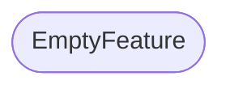
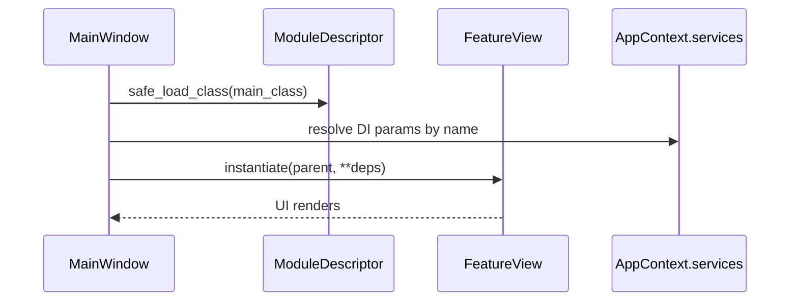

# EmptyFeature – Feature README

## Zweck
- Template/Skeleton mit Platzhaltern. Nicht importierbar bis die Platzhalter ersetzt wurden.

## Discovery
- `meta.json` ist die Discovery-Quelle (required keys: `id`, `label`, `version`, `main_class`).
- `id`: `emptyfeature`
- `main_class`: `EmptyFeature.gui.modul_view.<REPLACE_ME>`

## Contracts (contracts.json)
### Provides
- UI `main_view`: `EmptyFeature.gui.modul_view.<REPLACE_ME>`

### Requires
- Services: *(none detected via constructor DI)*

## Usage
1. Feature-Ordner enthält `meta.json` (und künftig auch `contracts.json`).
2. App startet über `main.py` → `framework.gui.main_window.MainWindow`.
3. Navigation lädt `main_class` über `ModuleDescriptor.safe_load_class()`.
4. DI erfolgt über Parameternamen im `__init__` (keyword-only params).

## Diagrams
### Dependencies

### Load + DI

## Open Points / TODOs
- Interfaces/ABCs (`core/contracts/*`) sind im Repo noch nicht vorhanden → `contracts.json` referenziert bewusst keine Interface-Pfade.
- Dieses Feature enthält Template-Platzhalter in `gui/modul_view.py` / `gui/modul_settings_view.py`.

