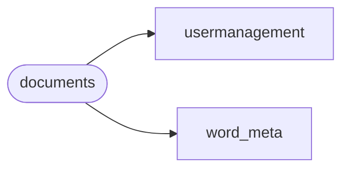
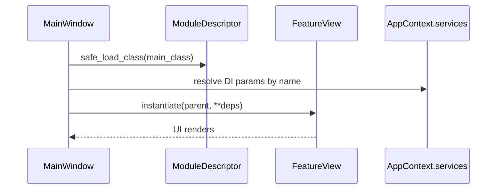

# documents – Feature README

## Zweck
- UI-Modul für Dokumentenlenkung (Listen/Details/RBAC) und Integrationspunkt für Signatur/Word-Metadaten.

## Discovery
- `meta.json` ist die Discovery-Quelle (required keys: `id`, `label`, `version`, `main_class`).
- `id`: `documents`
- `main_class`: `documents.gui.main_view.DocumentsView`
- `settings_class`: `documents.gui.settings_view.DocumentsSettingsTab`

## Contracts (contracts.json)
### Provides
- UI `main_view`: `documents.gui.main_view.DocumentsView`
- UI `settings_view`: `documents.gui.settings_view.DocumentsSettingsTab`

### Requires
- Services (DI-by-name):
  - `settings_manager` (required)
  - `sm` (required)
- Feature-Dependencies:
  - `usermanagement`
  - `word_meta`

## Usage
1. Feature-Ordner enthält `meta.json` (und künftig auch `contracts.json`).
2. App startet über `main.py` → `framework.gui.main_window.MainWindow`.
3. Navigation lädt `main_class` über `ModuleDescriptor.safe_load_class()`.
4. DI erfolgt über Parameternamen im `__init__` (keyword-only params).

## Diagrams
### Dependencies

### Load + DI

## Open Points / TODOs
- Interfaces/ABCs (`core/contracts/*`) sind im Repo noch nicht vorhanden → `contracts.json` referenziert bewusst keine Interface-Pfade.

