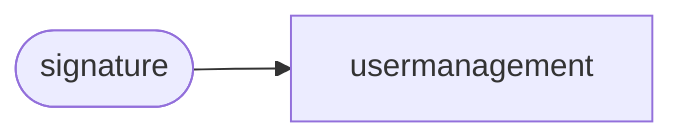
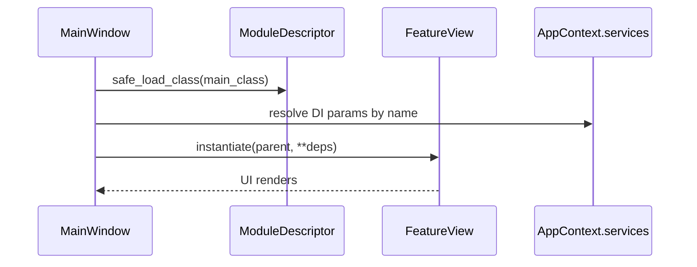

# signature – Feature README

## Zweck
- UI-Modul für PDF/Signatur-Workflows (inkl. Passwort-Prompt, Signatur-API Integration).

## Discovery
- `meta.json` ist die Discovery-Quelle (required keys: `id`, `label`, `version`, `main_class`).
- `id`: `core_signature`
- `main_class`: `signature.gui.signature_view.SignatureView`
- `settings_class`: `signature.gui.signature_settings_view.SignatureSettingsView`

**Achtung:** `meta.json.id` entspricht nicht dem Ordnernamen (`signature`). Das kann gegen Projektkonventionen verstoßen.

## Contracts (contracts.json)
### Provides
- UI `main_view`: `signature.gui.signature_view.SignatureView`
- UI `settings_view`: `signature.gui.signature_settings_view.SignatureSettingsView`

### Requires
- Services (DI-by-name):
  - `settings_manager` (required)
  - `sm` (required)
- Feature-Dependencies:
  - `usermanagement`

## Usage
1. Feature-Ordner enthält `meta.json` (und künftig auch `contracts.json`).
2. App startet über `main.py` → `framework.gui.main_window.MainWindow`.
3. Navigation lädt `main_class` über `ModuleDescriptor.safe_load_class()`.
4. DI erfolgt über Parameternamen im `__init__` (keyword-only params).

## Diagrams
### Dependencies

### Load + DI

## Open Points / TODOs
- Interfaces/ABCs (`core/contracts/*`) sind im Repo noch nicht vorhanden → `contracts.json` referenziert bewusst keine Interface-Pfade.
- DI verlangt gleichzeitig `settings_manager` und `sm` (siehe Constructor). Das erhöht Integrationsrisiko.

